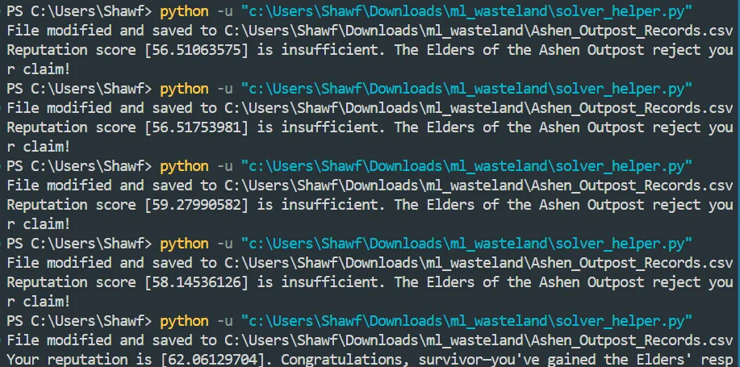

# Cyber Apocalypse'25

## Cyber Apocalypse

## ML

### Enchanted Weights

* The given file was a `.pth` file.
* It is a PyTorch file.

```python
import torch
torch.set_printoptions(threshold=torch.inf)
checkpoint = torch.load(r"C:\Users\Shawf\Downloads\ml_enchanted_weights\eldorian_artifact.pth")
print("Hello")
print(checkpoint)
```

```python
OrderedDict({'hidden.weight': tensor([[ 72.,   0.,   0.,   0.,   0.,   0.,   0.,   0.,   0.,   0.,   0.,   0.,
           0.,   0.,   0.,   0.,   0.,   0.,   0.,   0.,   0.,   0.,   0.,   0.,
           0.,   0.,   0.,   0.,   0.,   0.,   0.,   0.,   0.,   0.,   0.,   0.,
           0.,   0.,   0.,   0.],
        [  0.,  84.,   0.,   0.,   0.,   0.,   0.,   0.,   0.,   0.,   0.,   0.,
           0.,   0.,   0.,   0.,   0.,   0.,   0.,   0.,   0.,   0.,   0.,   0.,
           0.,   0.,   0.,   0.,   0.,   0.,   0.,   0.,   0.,   0.,   0.,   0.,
           0.,   0.,   0.,   0.],
        [  0.,   0.,  66.,   0.,   0.,   0.,   0.,   0.,   0.,   0.,   0.,   0.,
           0.,   0.,   0.,   0.,   0.,   0.,   0.,   0.,   0.,   0.,   0.,   0.,
           0.,   0.,   0.,   0.,   0.,   0.,   0.,   0.,   0.,   0.,   0.,   0.,
           0.,   0.,   0.,   0.],
        [  0.,   0.,   0., 123.,   0.,   0.,   0.,   0.,   0.,   0.,   0.,   0.,
           0.,   0.,   0.,   0.,   0.,   0.,   0.,   0.,   0.,   0.,   0.,   0.,
           0.,   0.,   0.,   0.,   0.,   0.,   0.,   0.,   0.,   0.,   0.,   0.,
           0.,   0.,   0.,   0.],
        [  0.,   0.,   0.,   0.,  67.,   0.,   0.,   0.,   0.,   0.,   0.,   0.,
           0.,   0.,   0.,   0.,   0.,   0.,   0.,   0.,   0.,   0.,   0.,   0.,
           0.,   0.,   0.,   0.,   0.,   0.,   0.,   0.,   0.,   0.,   0.,   0.,
           0.,   0.,   0.,   0.],
        [  0.,   0.,   0.,   0.,   0., 114.,   0.,   0.,   0.,   0.,   0.,   0.,
           0.,   0.,   0.,   0.,   0.,   0.,   0.,   0.,   0.,   0.,   0.,   0.,
           0.,   0.,   0.,   0.,   0.,   0.,   0.,   0.,   0.,   0.,   0.,   0.,
           0.,   0.,   0.,   0.],
       
       ....
```

Then I wrote the code to decode the crystal structure:

```python
import torch

torch.set_printoptions(threshold=torch.inf)
checkpoint = torch.load(r"C:\Users\Shawf\Downloads\ml_enchanted_weights\eldorian_artifact.pth")

print("Checkpoint keys:", checkpoint.keys())

# Attempt to extract a flag from the hidden.weight tensor
hidden_tensor = checkpoint.get('hidden.weight')
if hidden_tensor is None:
    print("No hidden.weight key found.")
else:
    # Flatten the tensor to traverse all values
    flat = hidden_tensor.flatten().tolist()
    # Convert tensor value to characters if they map to valid ASCII (range 32-126)
    try:
        flag_chars = ''.join(chr(int(round(x))) for x in flat if 32 <= int(round(x)) <= 126)
        print("Extracted flag (if encoded as ASCII values):", flag_chars)
    except Exception as e:
        print("Error extracting flag:", e)
```

#### Flag

.png>)

### WasteLand

* I was given a CSV file and a Python code to send data to the server.
* It calculates the reputation score based on all the values of the CSV file.
* I tried to edit my record, but then it got flagged. So I edited others’ and it worked.
* I made the reputation of all to be either 66 or 88 except for a few.
* Then the corrupt mutations I made them 6, 4, or 2.
* Then the shadow crimes I made a few 8.
* Then I started reducing the dragonfire resistance and reputation started increasing drastically.
* So by trial and error I figured the correct values.

[Ashen\_Outpost\_Records.csv](/broken/pages/449f2c23cbc18705046542ebfd09cfdffdf350ab)



#### Flag

HTB{4sh3n\_D4t4\_M4st3r}

***
